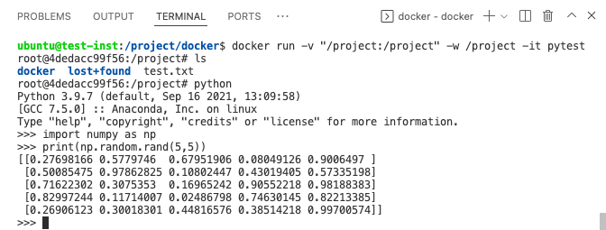
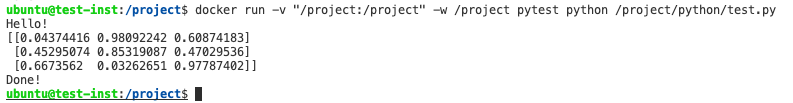
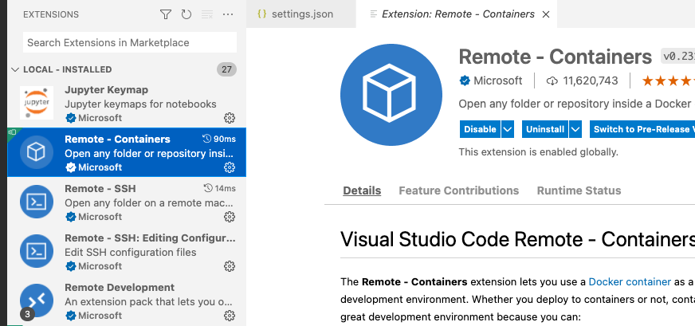
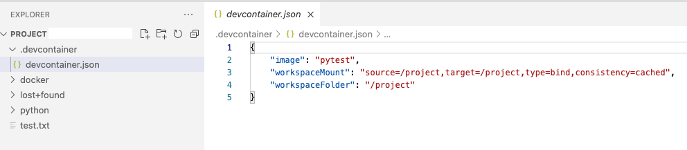
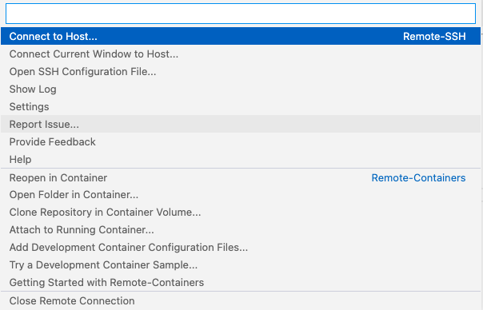

<h1>NIMBUS User Guide for DARE</h1>

- [1. Sign up](#1-sign-up)
- [2. Using Nimbus](#2-using-nimbus)
  - [2.1 Initialising a Nimbus Instance](#21-initialising-a-nimbus-instance)
- [3. Setting up your Nimbus instance](#3-setting-up-your-nimbus-instance)
- [4. Using docker](#4-using-docker)
  - [4.1 Creating a docker container](#41-creating-a-docker-container)
  - [4.2 Running a python script in a docker container](#42-running-a-python-script-in-a-docker-container)
  - [4.3 Connecting into a docker container on Nimbus with Visual Studio Code](#43-connecting-into-a-docker-container-on-nimbus-with-visual-studio-code)

Pawsey’s cloud service, Nimbus is a national research-specific cloud service, open to any Australian researcher, including from state government. It is flexible and scalable to your research needs.  You are able to access it whenever you wish, with no waiting in queues and you have total control over your instances to install and run whatever you want. It provides a great intermediary between the University of Sydney's HPC Artemis (for cluster jobs, using big data, or with large RAM needs) and your own local laptop/desktop. It can be used to great effect for medium-sized jobs, removing the need to thrash your laptop day and night!

## 1. Sign up
You can signup for Nimbus through the <a href="https://apply.pawsey.org.au">Pawsey Application Portal</a>. Once you hit the "Login" button and select "The University of Sydney", you will be able to use your sso credentials.

<a href="https://support.pawsey.org.au/documentation/display/US/Apply+for+Nimbus+Cloud+access">This guide</a> guides you through the application process. This application asks you to provide details on:

- Your work to justify the allocation.
    - NOTE: If you are asking for a relatively small amount of resources (e.g., 1 or 2 instances) it is highly likely you’ll be approved. If you are asking for larger amounts of resources then you will need a more detailed description on why you need that amount.
    - You therefore don't need to go into great detail as to your use if you just want a standard "flavour". GPUs are also in high demand and will need to be justified.
- You will be asked to select an instance "flavour" corresposding to the CPU/RAM combination you will require for your reasearch.
    - A guide to choosing from the "flavours" can be found <a href="https://support.pawsey.org.au/documentation/display/US/How+to+Choose+a+Flavour">here</a>. <b>If you are unsure of which flavour to choose, please talk to one of the DARE research engineers for assistance.</b>

After sumbission, there will be a wait time of a few days before your application is approved.

All projects now have a <b>six-month validity period</b>, after which an application must be submitted for an extension if continued Nimbus use is required (an automated email will be sent with a link to a pre-filled form).

## 2. Using Nimbus
### 2.1 Initialising a Nimbus Instance
A comprehensive guide can be found here, but please feel free to get in contact with one of the DARE research engineers if you require assistance on any of the below:

<a>https://pawseysc.github.io/using-nimbus/</a>

This guide takes you through the steps of:

- <a href="https://support.pawsey.org.au/documentation/pages/viewpage.action?pageId=59475436#CreateaNimbusInstance-Generateakeypair">Generating a key pair for authentication</a>
- <a href="https://support.pawsey.org.au/documentation/display/US/Create+a+Nimbus+Instance">Launching an instance</a>, including the specification of compute resources:
    - Choosing an instance image - you can find the various Ubuntu etc images <a href="https://support.pawsey.org.au/documentation/display/US/How+to+Choose+an+Image">here</a>.
    - Choose a volume size for this image - this should be just enough to cover the operating system. We will create a separate volume for your scripts/data later.
    - Choosing network settings - you should use the Public External network option for most use cases. Otherwise you will need to allocate a floating IP.
    - Security Group - ensuring that <xxxxx>-SSH is added to allow SSH access.
- <a href="https://support.pawsey.org.au/documentation/display/US/Managing+Project+and+Instance+Access">Accessing your instance</a>
    - Following the instructions your ssh call should look like `ssh -i ~/.ssh/My_Key_Pair.pem ubuntu@148.118.##.##` (note the login name is just the instance type e.g., ubuntu).
    - The easiest way to do this for most DARE users is via the <a href="https://code.visualstudio.com">Visual Studio Code editor</a> and the "Remote Development" extension pack. You can follow the instructions <a href="https://support.pawsey.org.au/documentation/pages/viewpage.action?pageId=45518082#AccessandUseYourNimbusInstance-LoginviaVisualStudioCode">here</a> to set this up.
    - alternatively you can ssh from your favourite terminal

## 3. Setting up your Nimbus instance 
We will create a separate volume to store our data and mount this to the instance. This avoids any problems that could occur if you fill up the actual instance volume. You can follow the instructions <a href="https://support.pawsey.org.au/documentation/display/US/Manage+a+Data+Volume">here</a> to:

- On the Dashboard:
    - Use the dashboard to create a volume (specifying size)
    - Attach it to your instance
- From your ssh session (in terminal or via Visual Studio Code):
    - Check the volume exists and format it (only if its a new volume)
    - mount the file system - mount this to `/project` to follow the docker example below:
      - check the volume: `sudo fdisk -l /dev/vdc`
      - (ONLY) if this is a new volume then `sudo mkfs.ext4 /dev/vdc` (this will erase contents of the volume)
      - mount to `/project` with: `sudo mount /dev/vdc /project`
    - set permissions to ensure you can access
      - `sudo chown ubuntu /project` 

The best way to trasnfer files for most use cases is to use an ftp/sftp client (you can also use command line tools e.g., scp, rsync). Filezilla is a popular client and instructions for its use with Nimbus can be found <a href="https://support.pawsey.org.au/documentation/pages/viewpage.action?pageId=59475450#TransferYourData-TransferswithFilezilla">here</a>. A great choice on Mac is Cyberduck for which you would:

- Click "Open connection" button
- Copy your public external IP (148.118.##.##) to `server`
- `username`: ubuntu (or your selected instance flavour)
- select your SSH private key from the dropdown. This should appear automatically if you have your key stored in `~/.ssh/`
- connect!

This guide covers some basic use cases, but does not touch on any of the more advanced supercomuting features of Nimbus. For more information on these features, please see the <a href="https://support.pawsey.org.au/documentation/display/US/Advanced+Topics">Nimbus User Guide</a> or chat to a DARE research engineer.

## 4. Using docker
### 4.1 Creating a docker container
Below is an example using docker to ensure a consistent python environment from your local computer to the Nimbus instance. If you need further help or need different software, please contact a DARE research engineer.

First we need to develop a Dockerfile to describe our environment. There is a wealth of information on creating Dockerfiles. For this example we will generate a container with an ubuntu version of linux, with Python installed. A simple introduction can be found <a href="https://faun.pub/hello-world-in-docker-using-python-9b3eb418fb15">here</a>:

The code for our Dockerfile is below:

```docker
# syntax=docker/dockerfile:1
FROM ubuntu:18.04
# create a directory to mount our data volume
RUN mkdir /project
#Install ubuntu libraires and packages
RUN apt-get update -y && \
    apt-get install git curl -y
#Set some environemnt variables we will need
ENV PATH="/build/miniconda3/bin:${PATH}"
ARG PATH="/build/miniconda3/bin:${PATH}"
RUN mkdir /build && \
    mkdir /build/.conda
#Install Python3.9 via miniconda
RUN curl -O https://repo.anaconda.com/miniconda/Miniconda3-latest-Linux-x86_64.sh &&\
    bash Miniconda3-latest-Linux-x86_64.sh -b -p /build/miniconda3 &&\
    rm -rf /Miniconda3-latest-Linux-x86_64.sh
WORKDIR /build
RUN conda install python=3.9 numpy ipykernel
```

Briefly, we are:
- using the Ubuntu 18.04 base image
- ensuring it's packages are up to date (using apt-get) 
- Creating the /project directory
    - NOTE we will mount the created Nimbus volume to this
- Adding paths to the conda install so that we can use "conda install …."
- Downloading and installing the latest version of miniconda
- Ensuring Python 3.9 and numpy are installed.

You can then add code on the end to install any python package you would like as you would on your usual conda install - via pip, conda-forge or a yml file.

### 4.2 Running a python script in a docker container

Now lets build this docker image on the Nimbus instance remembering the instructions for SSH connection from Visual Studio Code <a href="https://support.pawsey.org.au/documentation/pages/viewpage.action?pageId=45518082#AccessandUseYourNimbusInstance-LoginviaVisualStudioCode">here</a>:

1. Save your Dockerfile from the code above to a file `pytest.Dockerfile` and transfer it to Nimbus using Cyberduck (or FileZilla) to the location `/project/docker/pytest.Dockerfile`. 
2. Using your ssh session or Visual Studio Code, navigate to the location of your Dockerfile
    - `cd /project/docker/`
3. Build the image from our `pytest.Dockerfile` and name it `pytest` using the command:
    - `docker build --tag pytest -f pytest.Dockerfile .`
4. Wait for docker to build the image, downloading the packages etc that it needs
5. We can run interactive sessions (say for the pytest image) to try things out with something like
`docker run -v "/project:/project" -w /project -it pytest`
    - This creates an interactive session with the image
    - Maps your directory (mounted volume) `/project` to an equivalent location `/project` within the docker image so that you can access the files you have on Nimbus
    - changes the working directory in the docker instance to `/project`
6. You can terminate the session with `exit`

Below you can see an example checking Python works correctly on Nimbus running a docker container (as per the Dockerfile installation above). This example uses Visual Studio Code to connect to Nimbus:

<p align='center'>
  
</p>

As a further test, we will copy the files "test.py" and "test.ipynb" from the `examples` directory of this repository to a folder on our nimbus instance - `/project/python`. We can run our script `test.py` from the command line using:

```docker
docker run -v "/project:/project" -w /project pytest python /project/python/test.py
```

With the output as shown below:

<p align='center'>
  
</p>

### 4.3 Connecting into a docker container on Nimbus with Visual Studio Code

With a little configuration of Visual Studio Code we can connect directly to a docker container on Nimbus. This can be useful to interactively run code on Nimbus either directly from a .py file (including debugging) or from a Jupyter Notebook. Starting from the same point as above, with the `/project` folder open in Visual Studio Code via SSH, we will do the following:

<!-- - Open the settings.json file
    - One way to get there would be to open the command palette with `cmd+shift+p` (Mac) or `ctrl+shift+p` (Windows)
    - type "open settings" and select "Preferences: Open Settings (JSON)" -->
- Ensure you have the "Remote - Containers" extension installed in Visual Studio Code (it may ask you to reinstall on your ssh session)
    <p align='center'>
        
    </p>
- In the `/project` directory create a subdirectory `/project/.devcontainer/` and file `/project/.devcontainer/devcontainer.json`
    - In this file we need the following to replicate the command from above (`docker run -v "/project:/project" -w /project -it pytest`)
    - Again we are telling Nimbus/docker use our built docker image `pytest`, mapping the `/project` folder to the container and changing the working directory in the docker container to `/project`
    ```json
        {
            "image": "pytest",
            "workspaceMount": "source=/project,target=/project,type=bind,consistency=cached",
            "workspaceFolder": "/project"
        }
    ```
    <p align='center'>
    
    </p>
- In the bottom left click the green "Remote Development" icon which should be showing your current SSH connection. This will show your remote development options and, if you have the "Remote - Containers" extension installed, you will see "Remote-Containers" settings as below.
    <p align='center'>
        
    </p>
- Select: "Open Folder in Container..."
- We will open our `/project` folder
- If you have followed the instructions for the `devcontainer.json` above you will now have a Visual Studio Code window open with a pytest Docker container on Nimbus - you can check that the "Remote Development" status in green in the bottom left reads something like:
    - `Dev Container @ssh://146.118.##.##`
- We can trial this by opening our `/project/python/test.ipynb` notebook. You should be able to select your conda environment, run and confirm we are in the correct working directory and with the correct CPU/Memory configuration of your Nimbus instance.
- You can use the remote development options to reopen the folder in SSH again to exit the docker container.
- `docker rm $(docker ps -a -q)` will kill all containers
- `docker image rm pytest` will delete your image